# DeveloperTools

`Developer Tools` 中集合了开发过程中常用的功能，比如 `哈希计算`、`编码转换`、`时间转换`、`图片简单处理` 等。

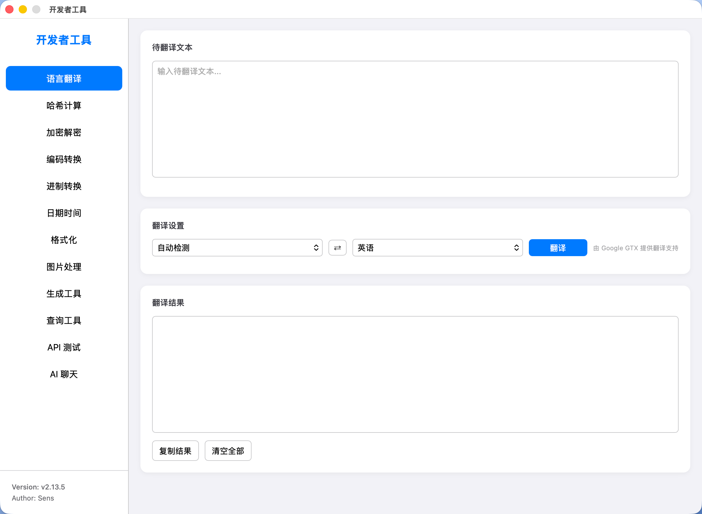
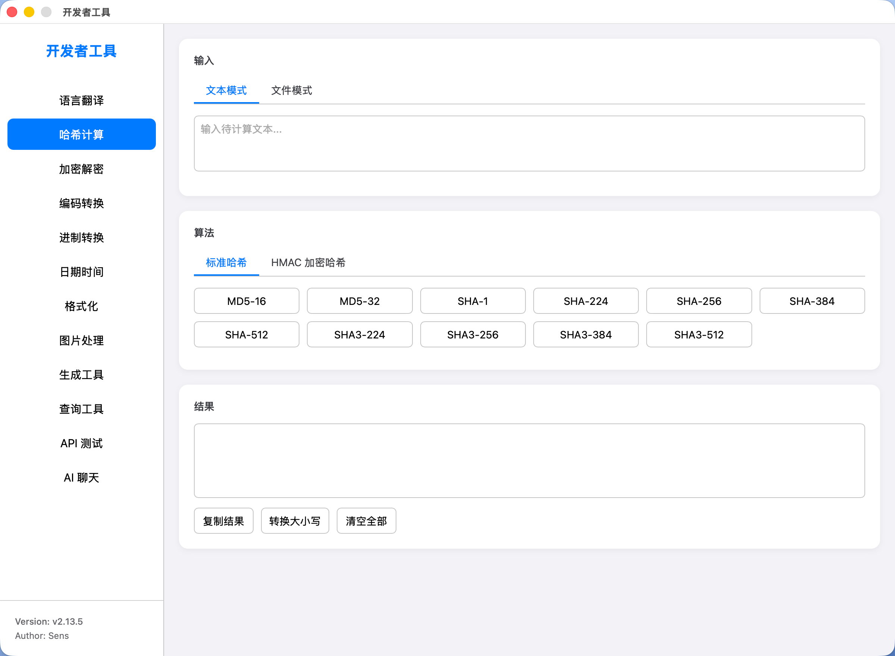
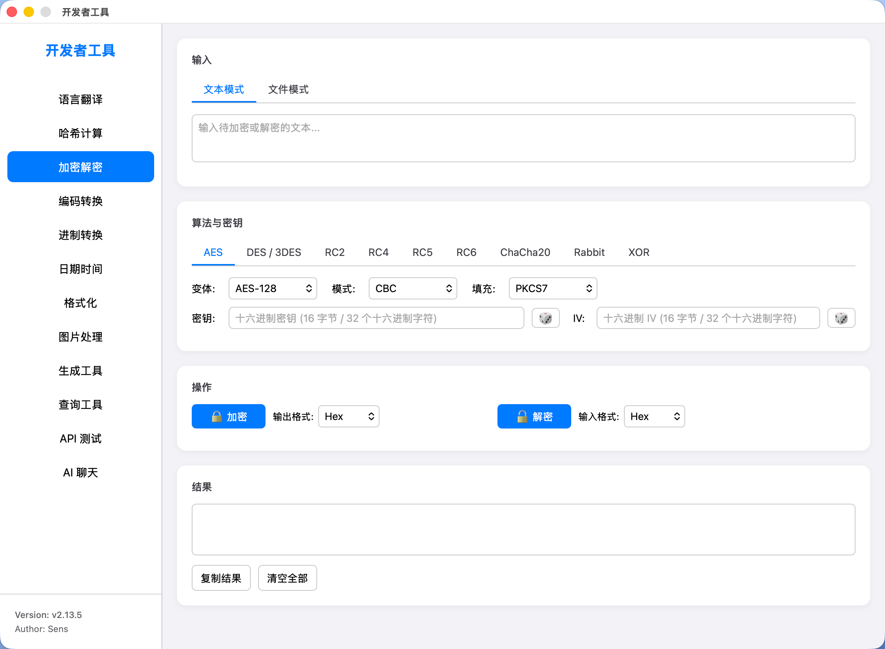
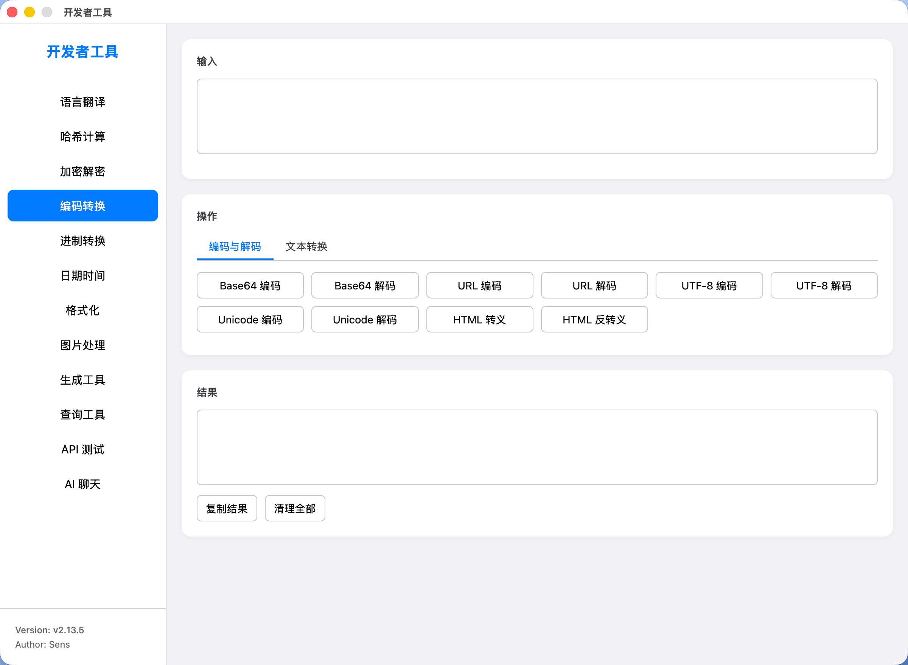
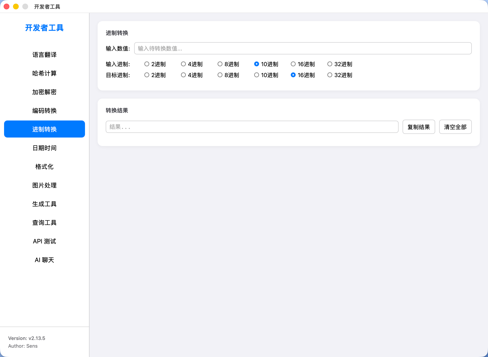
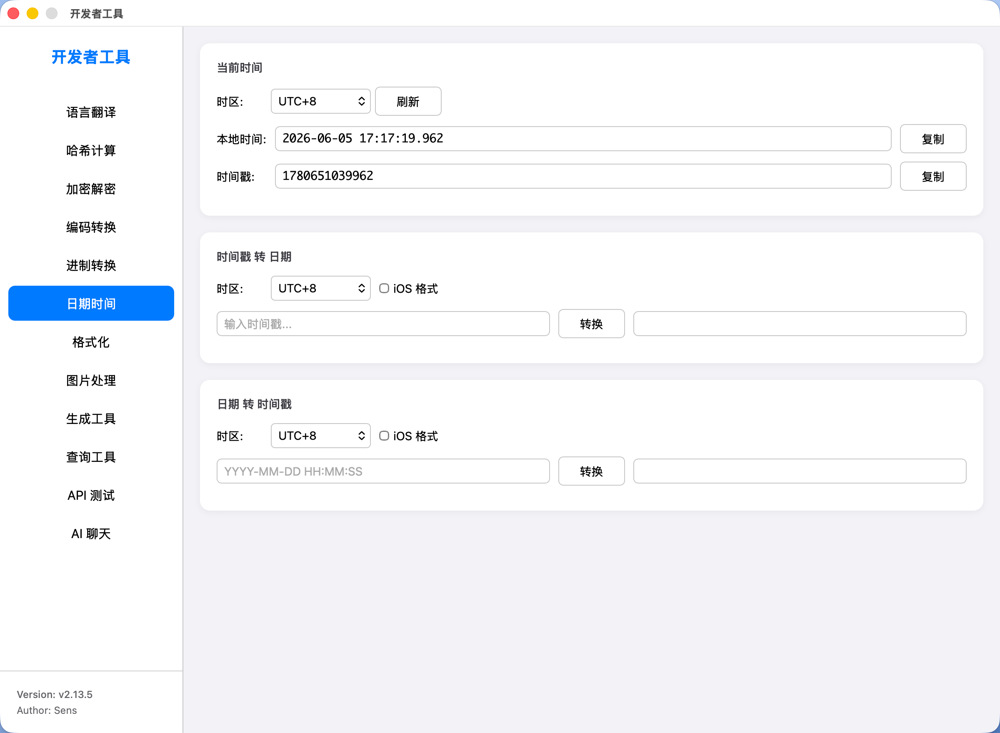
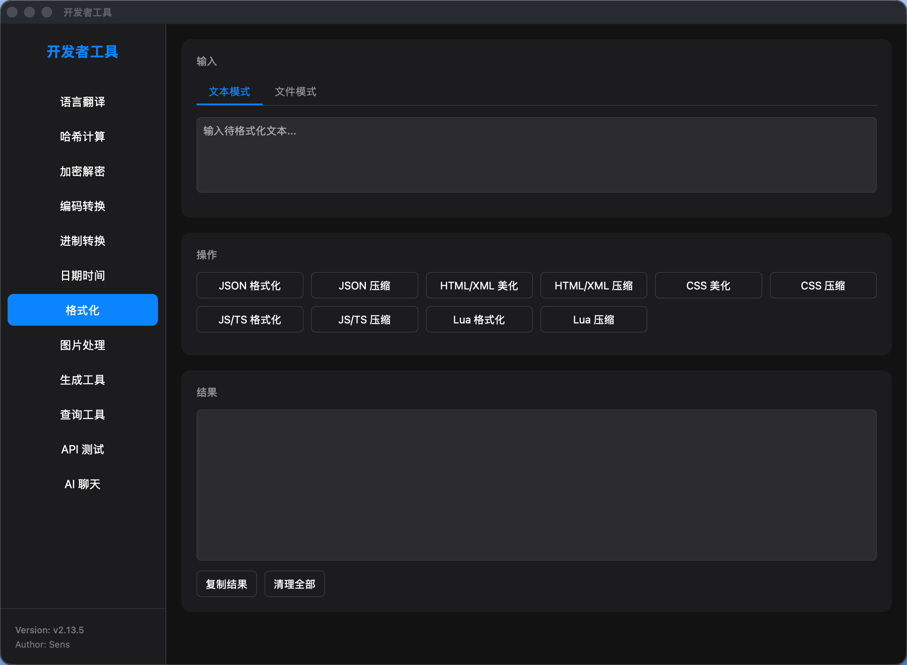
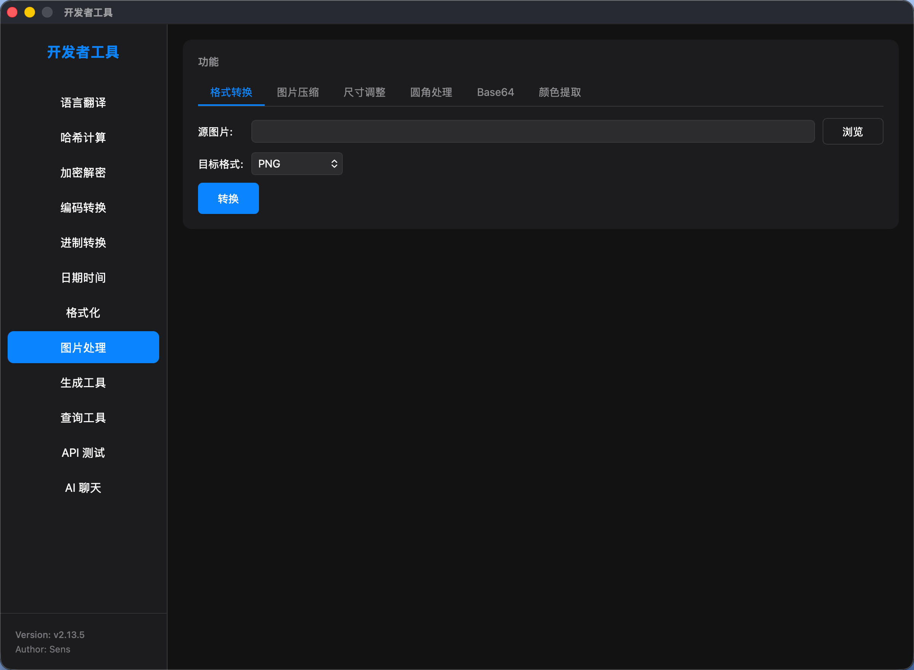
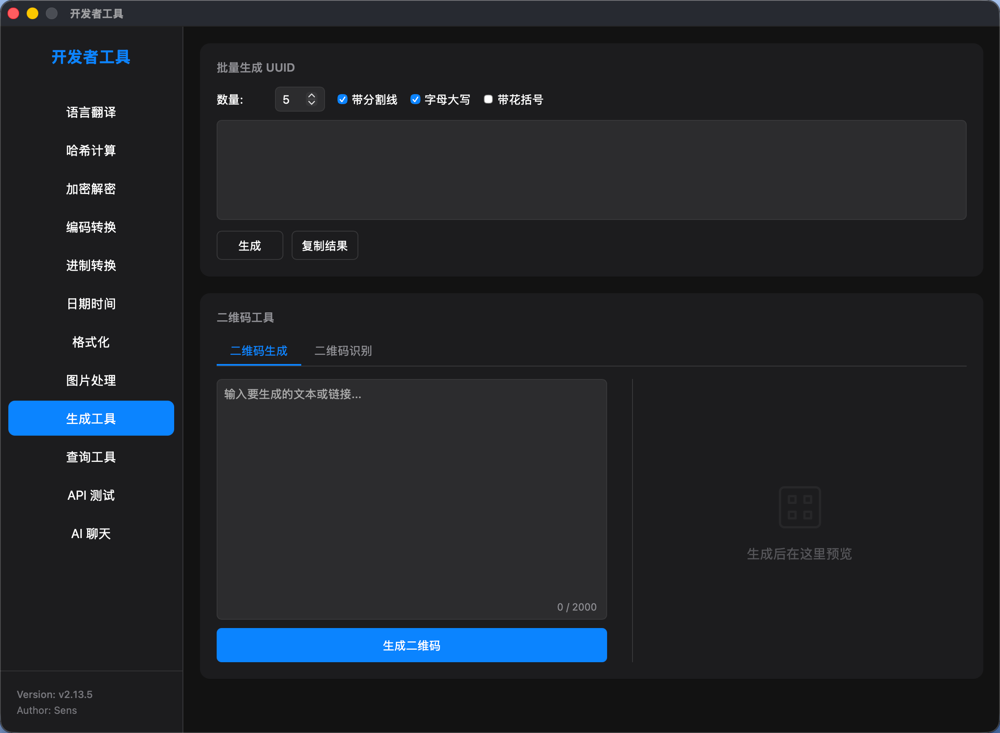
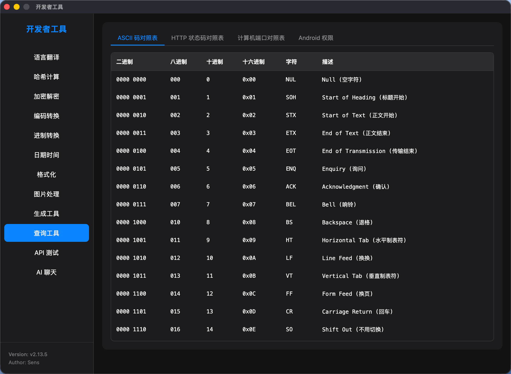
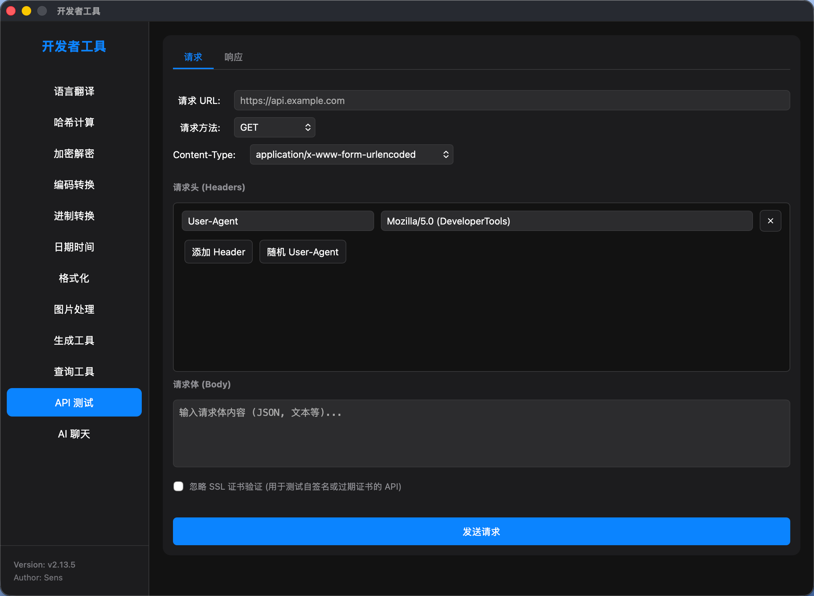
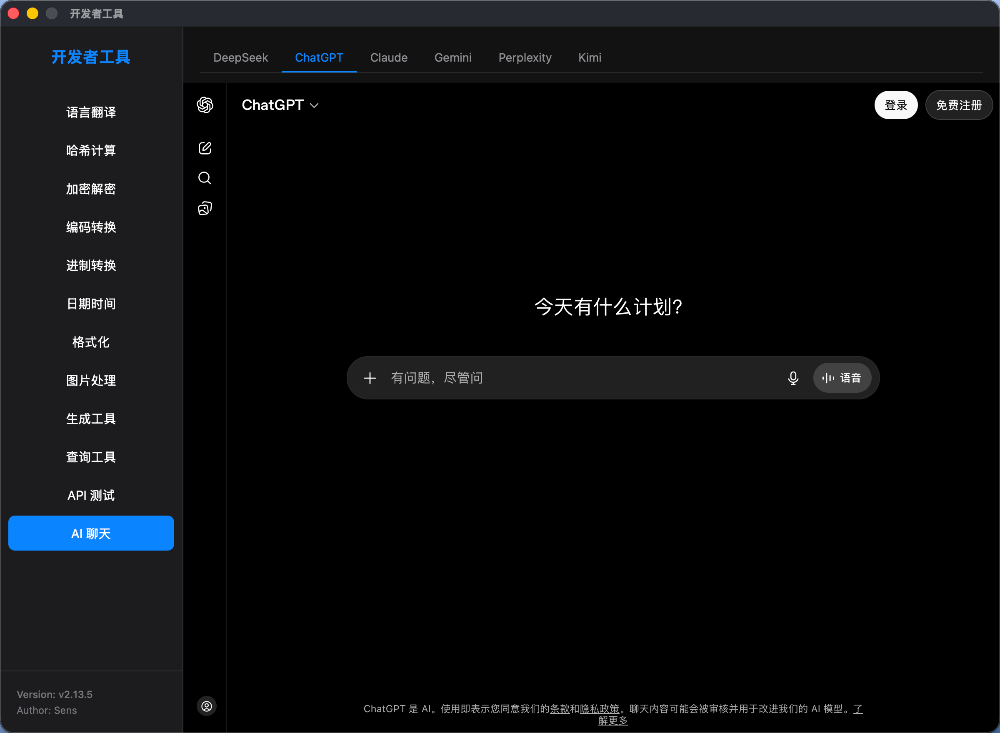

# windows 版本安装说明

下载 `DeveloperTools.exe`，免安装直接运行。

# macOS 版本安装说明

下载 `DeveloperTools-macos.tar.gz`，解压后得到 `DeveloperTools.app
`，然后将 `DeveloperTools.app` 复制到 `/Applications` 目录中。

第一次启动时，由于 app 的签名问题，会导致被系统阻止，需要手动允许：
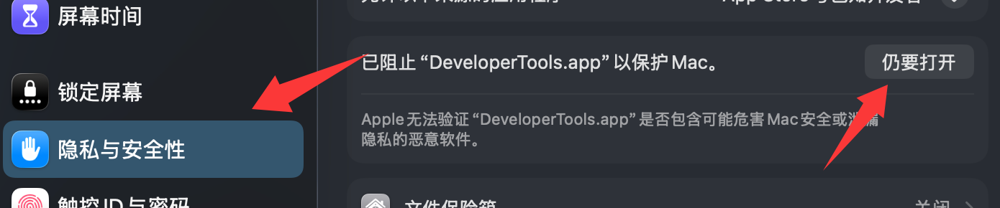